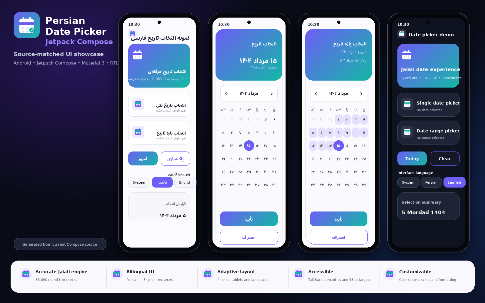

<div align="center">

# Persian Date Picker for Jetpack Compose

A production-oriented Jalali calendar engine and accessible date-picker library for Android.

[](https://github.com/ALISCHILLER/Date-Picker-Persian-Compose/actions/workflows/android.yml)
[](https://kotlinlang.org/)
[](https://developer.android.com/compose)
[](https://developer.android.com/about/versions/oreo)
[](LICENSE.md)

[فارسی](#نسخه-فارسی) · [English](#english-version)

</div>

<p align="center">
  <a href="docs/screenshots/app-showcase.png">
    
  </a>
</p>

<p align="center"><sub>Source-matched showcase based on the current Compose implementation; not presented as a verified emulator screenshot.</sub></p>

---

# نسخه فارسی

## معرفی

این مخزن دو کتابخانه مستقل ولی هماهنگ ارائه می‌کند:

| Artifact | کاربرد |
|---|---|
| `persian-calendar-core` | موتور خالص Kotlin/JVM برای مدل تاریخ جلالی، تبدیل میلادی، محاسبات روز، بازه و ارقام؛ بدون Android و Compose |
| `persian-date-picker-compose` | انتخاب تاریخ تکی و بازه در Jetpack Compose؛ این Artifact، Core را به‌صورت transitive دریافت می‌کند |

برنامه `:app` فقط Showcase است و منتشر نمی‌شود. معماری عمداً سبک نگه داشته شده است: چون کتابخانه منبع داده، شبکه یا دیتابیس ندارد، Repository، UseCase، DI و ViewModel مصنوعی به آن تحمیل نشده‌اند.

## نصب از Maven Central

پس از انتشار نسخه `1.0.0`:

```kotlin
// settings.gradle.kts
dependencyResolutionManagement {
    repositories {
        google()
        mavenCentral()
    }
}
```

برای UI Compose:

```kotlin
dependencies {
    implementation("io.github.alischiller:persian-date-picker-compose:1.0.0")
}
```

فقط برای موتور تقویم در پروژه JVM یا لایه Domain:

```kotlin
dependencies {
    implementation("io.github.alischiller:persian-calendar-core:1.0.0")
}
```

تا پیش از انتشار عمومی، مسیر `mavenLocal()` در [PUBLISHING.md](PUBLISHING.md) توضیح داده شده است.

## استفاده مدرن با State Holder

```kotlin
@Composable
fun DateField() {
    val constraints = remember {
        DatePickerConstraints(
            minDate = SoleimaniDate(1400, 1, 1),
            maxDate = SoleimaniDate(1450, 12, 29),
        )
    }
    val pickerState = rememberSingleDatePickerState(
        constraints = constraints,
    )
    var visible by rememberSaveable { mutableStateOf(false) }

    Button(onClick = { visible = true }) {
        Text(pickerState.selectedDate?.toString() ?: "انتخاب تاریخ")
    }

    if (visible) {
        PersianDatePickerDialog(
            state = pickerState,
            config = DatePickerConfig(constraints = constraints),
            onClose = { visible = false },
            onSelectionConfirmed = { result ->
                // مدل سازگار قبلی
                val legacyDate = result.date
                // مدل مستقل از Android
                val coreDate = result.jalaliDate
                visible = false
            },
        )
    }
}
```

انتخاب تأییدشده به پایین و Event به بالا حرکت می‌کند. State Holder یک کلاس ساده و Saveable است و مصرف‌کننده را به `ViewModel`، Lifecycle یا DI خاصی وابسته نمی‌کند.

## استفاده از Core

```kotlin
val jalali = JalaliDate(1404, 1, 1)
val gregorian: LocalDate = jalali.toGregorian()
val restored = JalaliDate.fromGregorian(gregorian)

val range = JalaliDateRange.of(
    JalaliDate(1404, 1, 1),
    JalaliDate(1404, 1, 7),
)
```

## معماری

```text
:app
  └── :calendar
        └── :calendar-core

:calendar-core
  ├── JalaliDate / JalaliDateRange
  ├── conversion and calendar arithmetic
  ├── digit normalization
  └── no Android, AndroidX, Compose, DI or coroutine dependency

:calendar
  ├── small typed entry points
  ├── saveable state holders and UDF events
  ├── constraints, formatting and localization
  ├── Material 3 Compose UI
  └── compatibility adapters for the existing API
```

تصمیم‌های مهم در [ARCHITECTURE.md](ARCHITECTURE.md) و ADRهای پوشه [`docs/adr`](docs/adr) ثبت شده‌اند. فهرست API پیشنهادی در [`docs/PUBLIC-API.md`](docs/PUBLIC-API.md) و مسیر مهاجرت در [`MIGRATION.md`](MIGRATION.md) قرار دارد.

## قابلیت‌ها

- انتخاب تاریخ تکی و بازه مرتب‌شده
- تبدیل قطعی جلالی و میلادی با مدل مستقل `JalaliDate`
- حداقل/حداکثر تاریخ، روزهای غیرفعال، Validator و محدودیت طول بازه
- اعتبارسنجی تمام روزهای میانی بازه به‌صورت پیش‌فرض
- فارسی و انگلیسی، RTL/LTR و ارقام فارسی، عربی و لاتین
- State restoration با Saverهای primitive
- Material 3، Light/Dark، Reduced Motion و Haptic قابل تنظیم
- TalkBack semantics، کنترل صفحه‌کلید و اهداف لمسی مناسب
- طراحی Responsive برای موبایل، تبلت، Landscape و پنجره قابل تغییر اندازه
- API قدیمی حفظ شده و مسیر مهاجرت به Core فراهم است

## ساختار پروژه

| ماژول | مسئولیت | انتشار |
|---|---|---|
| `:calendar-core` | منطق خالص تقویم | `persian-calendar-core` |
| `:calendar` | UI و API Compose | `persian-date-picker-compose` |
| `:app` | Showcase و تست دستی | منتشر نمی‌شود |
| `samples/maven-consumer` | تست مصرف Artifact از Maven Local | منتشر نمی‌شود |

## تست و کنترل کیفیت

بررسی مستقل Core بدون Android SDK:

```bash
./scripts/verify-repository.sh
```

بررسی مرز معماری، Secretهای واضح و تطابق منابع فارسی/انگلیسی:

```bash
./scripts/verify-architecture.sh
```

Verification کامل در محیط Android:

```bash
./gradlew \
  :calendar-core:check \
  :calendar:testDebugUnitTest \
  :app:testDebugUnitTest \
  :calendar:lintDebug \
  :app:lintDebug \
  :calendar:assembleRelease \
  :app:assembleDebug \
  :app:assembleRelease
```

تست دو مصرف‌کننده مستقل Maven (Android Compose و Java Core):

```bash
./scripts/verify-maven-consumer.sh
```

وجود Task یا Workflow به معنی موفقیت نیست؛ نتیجه هر نسخه باید از اجرای واقعی همان commit گزارش شود.

## انتشار

هر دو Artifact با یک نسخه منتشر می‌شوند:

```text
io.github.alischiller:persian-calendar-core:1.0.0
io.github.alischiller:persian-date-picker-compose:1.0.0
```

Workflow انتشار، تطابق Tag، تست‌ها، Lint، AAR/JAR، POM، Source/Javadoc artifacts، امضای GPG و مصرف مستقل را قبل از انتشار بررسی می‌کند. راهنمای کامل در [PUBLISHING.md](PUBLISHING.md) است.

## سخت‌سازی مهندسی و شواهد Release

- ورودی متنی Core با `JalaliDate.parse` نتیجه type-safe شامل `Success` یا خطای دقیق برمی‌گرداند؛ `parseOrNull` برای سازگاری باقی مانده است.
- `JalaliDate.today(clock)` و `JalaliCalendar.today(clock)` امکان تست قطعی و مستقل از ساعت سیستم را می‌دهند.
- `tryDispatch` و `trySelect` نتیجه قابل پردازش `Applied`، `RejectedByConstraints`، `Completed` یا `Restarted` ارائه می‌کنند.
- Sample App هیچ Permission درخواست نمی‌کند، Backup و Cleartext را غیرفعال کرده و localeهای `fa` و `en` را در Manifest اعلام می‌کند.
- Baseline Profileهای حدسی حذف شده‌اند؛ Profile فقط پس از Macrobenchmark و اندازه‌گیری واقعی اضافه می‌شود.
- هر Release شامل CycloneDX SBOM، SHA-256، metadata مربوط به Commit/Tag، License/Notice، GitHub provenance و SBOM attestation است.
- دستور یکپارچه بررسی‌های بدون Android SDK:

```bash
./scripts/verify-repository.sh
```

جزئیات امنیت در [`docs/SECURITY-MODEL.md`](docs/SECURITY-MODEL.md)، کنترل Release در [`docs/RELEASE-CHECKLIST.md`](docs/RELEASE-CHECKLIST.md)، تصمیم Toolchain در [`docs/TOOLCHAIN.md`](docs/TOOLCHAIN.md) و گزارش اجرای کامل در [`MASTER-PROMPT-IMPLEMENTATION-REPORT.md`](MASTER-PROMPT-IMPLEMENTATION-REPORT.md) ثبت شده است.

## وضعیت

- مرور ایستا و تست مستقل موتور Core: انجام‌شده
- Build کامل Android، Lint و Instrumented Test در این محیط: اجرا نشده؛ نیازمند Android SDK و Dependency Resolution
- وضعیت فعلی: **Production candidate / production-oriented — runtime and release verification required**

## مجوز

پروژه بدون تغییر مجوز تحت [GNU AGPL-3.0-only](LICENSE.md) منتشر می‌شود. مصرف‌کننده باید شرایط این مجوز را برای محصول خود بررسی کند.

---

# English Version

## Overview

This repository publishes two coordinated libraries:

| Artifact | Purpose |
|---|---|
| `persian-calendar-core` | Pure Kotlin/JVM Jalali date model, Gregorian conversion, arithmetic, ranges, and digit normalization; no Android or Compose dependency |
| `persian-date-picker-compose` | Single-date and date-range picker for Jetpack Compose; receives Core transitively |

The `:app` module is a showcase and is not published. The architecture deliberately avoids artificial repositories, use cases, dependency injection, and a library-owned ViewModel because the component has no network, database, or external data source.

## Install from Maven Central

After version `1.0.0` is published:

```kotlin
// settings.gradle.kts
dependencyResolutionManagement {
    repositories {
        google()
        mavenCentral()
    }
}
```

Compose UI:

```kotlin
dependencies {
    implementation("io.github.alischiller:persian-date-picker-compose:1.0.0")
}
```

Core-only JVM/domain usage:

```kotlin
dependencies {
    implementation("io.github.alischiller:persian-calendar-core:1.0.0")
}
```

Before the first public release, follow the `mavenLocal()` workflow in [PUBLISHING.md](PUBLISHING.md).

## Modern state-holder API

```kotlin
@Composable
fun DateField() {
    val constraints = remember {
        DatePickerConstraints(
            minDate = SoleimaniDate(1400, 1, 1),
            maxDate = SoleimaniDate(1450, 12, 29),
        )
    }
    val pickerState = rememberSingleDatePickerState(constraints = constraints)
    var visible by rememberSaveable { mutableStateOf(false) }

    Button(onClick = { visible = true }) {
        Text(pickerState.selectedDate?.toString() ?: "Select date")
    }

    if (visible) {
        PersianDatePickerDialog(
            state = pickerState,
            config = DatePickerConfig(constraints = constraints),
            onClose = { visible = false },
            onSelectionConfirmed = { result ->
                val compatibilityDate = result.date
                val androidFreeDate = result.jalaliDate
                visible = false
            },
        )
    }
}
```

Confirmed selection flows down and events flow up. The state holder is a plain saveable class and does not force a particular ViewModel, lifecycle owner, or DI framework on the host application.

## Core usage

```kotlin
val jalali = JalaliDate(1404, 1, 1)
val gregorian: LocalDate = jalali.toGregorian()
val restored = JalaliDate.fromGregorian(gregorian)

val range = JalaliDateRange.of(
    JalaliDate(1404, 1, 1),
    JalaliDate(1404, 1, 7),
)
```

## Architecture

```text
:app
  └── :calendar
        └── :calendar-core

:calendar-core
  ├── JalaliDate / JalaliDateRange
  ├── deterministic conversion and arithmetic
  ├── digit normalization
  └── no Android, AndroidX, Compose, DI, or coroutine dependency

:calendar
  ├── small typed entry points
  ├── saveable state holders and UDF events
  ├── constraints, formatting, and localization
  ├── Material 3 Compose UI
  └── compatibility adapters for the existing API
```

See [ARCHITECTURE.md](ARCHITECTURE.md), the decisions in [`docs/adr`](docs/adr), the supported entry points in [`docs/PUBLIC-API.md`](docs/PUBLIC-API.md), and [`MIGRATION.md`](MIGRATION.md).

## Capabilities

- Single-date and ordered date-range selection
- Deterministic Jalali/Gregorian conversion through the Android-free `JalaliDate`
- Min/max dates, disabled dates, validators, and maximum range length
- Full intermediate-day range validation by default
- Persian/English resources, RTL/LTR, and Persian/Arabic/Latin digits
- Primitive saveable state holders
- Material 3, light/dark themes, configurable motion and haptics
- TalkBack semantics, keyboard navigation, and accessible touch targets
- Responsive phone, tablet, landscape, and resizable-window layouts
- Compatibility API retained while new code can use the Core model

## Modules

| Module | Responsibility | Publication |
|---|---|---|
| `:calendar-core` | Pure calendar logic | `persian-calendar-core` |
| `:calendar` | Compose UI and public picker API | `persian-date-picker-compose` |
| `:app` | Showcase and manual verification | Not published |
| `samples/maven-consumer` | Independent Maven-local consumer test | Not published |

## Verification

Core verification without Android tooling:

```bash
./scripts/verify-core-standalone.sh
```

Architecture boundaries, obvious secret patterns, and bilingual resource parity:

```bash
./scripts/verify-architecture.sh
```

Full Android environment:

```bash
./gradlew \
  :calendar-core:check \
  :calendar:testDebugUnitTest \
  :app:testDebugUnitTest \
  :calendar:lintDebug \
  :app:lintDebug \
  :calendar:assembleRelease \
  :app:assembleDebug \
  :app:assembleRelease
```

Independent Android Compose and Java Core published-artifact smoke tests:

```bash
./scripts/verify-maven-consumer.sh
```

A configured task or workflow is not evidence that it passed. Release status must be based on the actual target commit execution.

## Publishing

Both artifacts share the same release version:

```text
io.github.alischiller:persian-calendar-core:1.0.0
io.github.alischiller:persian-date-picker-compose:1.0.0
```

The release workflow verifies tag/version alignment, tests, lint, artifacts, POM metadata, source/Javadoc artifacts, GPG signing, and an independent Maven consumer before publishing. See [PUBLISHING.md](PUBLISHING.md).

## Engineering hardening and release evidence

- `JalaliDate.parse` returns a type-safe `Success` or a precise validation failure; `parseOrNull` remains for compatibility.
- `JalaliDate.today(clock)` and `JalaliCalendar.today(clock)` support deterministic clock-controlled tests.
- `tryDispatch` and `trySelect` expose machine-readable outcomes such as `Applied`, `RejectedByConstraints`, `Completed`, and `Restarted`.
- The sample app requests no permissions, disables backup and cleartext traffic, and declares `fa` and `en` locales in its manifest.
- Unmeasured baseline-profile placeholders were removed. Profiles should be added only after Macrobenchmark evidence exists.
- Every release produces a CycloneDX SBOM, SHA-256 checksums, source commit/tag metadata, License/Notice material, GitHub provenance, and an SBOM attestation.
- Aggregate checks that do not require an Android SDK:

```bash
./scripts/verify-repository.sh
```

See [`docs/SECURITY-MODEL.md`](docs/SECURITY-MODEL.md), [`docs/RELEASE-CHECKLIST.md`](docs/RELEASE-CHECKLIST.md), [`docs/TOOLCHAIN.md`](docs/TOOLCHAIN.md), and [`MASTER-PROMPT-IMPLEMENTATION-REPORT.md`](MASTER-PROMPT-IMPLEMENTATION-REPORT.md).

## Current status

- Static review and standalone Core verification: completed
- Full Android build, lint, and instrumented tests in this analysis environment: not executed; Android SDK and dependency resolution are required
- Current classification: **Production candidate / production-oriented — runtime and release verification required**

## License

The project remains licensed under [GNU AGPL-3.0-only](LICENSE.md). Consumers are responsible for reviewing the license requirements for their distribution model.
